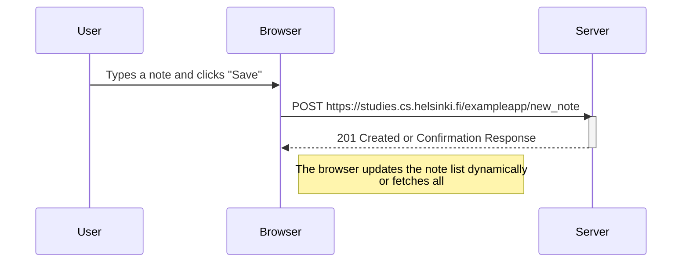

```mermaid
sequenceDiagram
    participant user as User
    participant browser as Browser
    participant server as Server

    user->>browser: Types a note and clicks "Save"
    browser->>server: POST https://studies.cs.helsinki.fi/exampleapp/new_note
    activate server
    server-->>browser: 201 Created or Confirmation Response
    deactivate server
    Note right of browser: The browser updates the note list dynamically<br>or fetches all
```